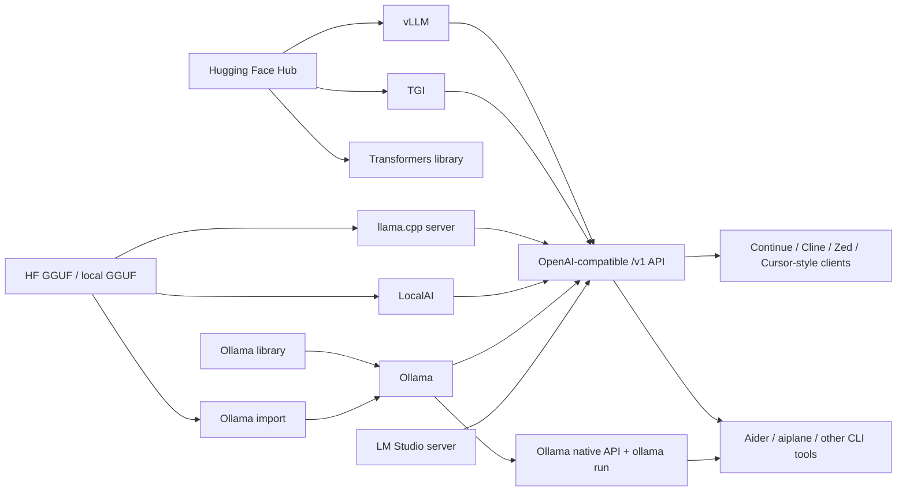

# Model Sources and Runtimes

A **model source/catalog** is where model files or model identifiers come from. A
**runtime** is the program that loads those files into CPU/GPU memory and answers
prompts.



The `OpenAI-compatible /v1 API` node is an API shape, not the OpenAI cloud
provider. Continue and similar tools can use vLLM, Ollama, llama.cpp server,
LocalAI, LM Studio, or TGI gateways when they expose a compatible endpoint and
the selected tool supports that endpoint configuration. Managed cloud providers
are provider/service entries, not self-managed runtimes. Keep their `provider`
set to the hosted service such as `openai`, `azure_openai`, or `elevenlabs`; do not null it.
Runtime-fit filters intentionally exclude managed-service models unless the
model explicitly declares compatible runtime metadata.

## Commands

Show the source/runtime map:

```bash
aiplane runtimes map
aiplane runtimes sources
aiplane runtimes list
```

Group configured models by runtime:

```bash
aiplane runtimes models
aiplane runtimes models vllm
```

Show which runtimes can run one model:

```bash
aiplane runtimes model MODEL_ALIAS
```

Set a preferred runtime for a model:

```bash
aiplane runtimes use MODEL_ALIAS vllm
aiplane runtimes use MODEL_ALIAS tgi
```

This writes `preferred_runtime` to the editable profile model entry. It does not
modify the shipped profile template.

Check runtime availability:

```bash
aiplane runtimes doctor
aiplane runtimes doctor vllm
```

Check runtime installer/start prerequisites before using the helper:

```bash
aiplane runtimes prerequisites ollama
aiplane runtimes prerequisites vllm
aiplane runtimes prerequisites all
```

`runtimes doctor` answers "is the runtime reachable or usable now?".
`runtimes prerequisites` answers "are the host tools present for `aiplane` to attempt install/start/pull workflows?". When a runtime is unavailable, runtime status output includes suggested follow-up commands, usually a prerequisites check and helper dry-runs such as `aiplane runtimes install vllm --dry-run` or `aiplane runtimes start vllm --dry-run`.


## Runtime Command Reference

All runtime lifecycle commands use this shape:

```bash
aiplane runtimes <command> --profile <profile> <runtime> [--model <model>] [--dry-run]
```

Common options:

- `--profile`: selects the editable profile, for example `local-dev`. The profile provides model aliases, default models, source-provider config, and any explicit local endpoint overrides. Without overrides, runtime endpoints come from built-in conventional defaults and still need doctor/test checks before use.
- `<runtime>`: the runtime/provider name to operate on, such as `ollama`, `vllm`, `tgi`, `transformers`, `localai`, `llamacpp`, or `lmstudio`.
- `--model`: model alias or runtime-native model id. It can be a configured alias like `MODEL_ALIAS`, a Hugging Face id like `Provider/Code-Large-Instruct`, a raw Ollama id like `text-generation:0.5b`, a direct GGUF URL for llama.cpp, or `all` where the runtime supports it.
- `--dry-run`: prints the helper command and delegated runtime command without installing packages, downloading models, starting services, or changing files.

Lifecycle commands:

- `configure`: writes or previews non-secret provider/runtime environment templates. It does not write real API keys.
- `install`: installs the runtime where supported. Examples: pip install for `vllm`/`transformers`, Docker image pull for `tgi`/`localai`, Ollama official installer for `ollama`. Real installs run a prerequisites preflight first; if required host tools are missing, `aiplane` prints the missing tools and Ubuntu/Debian package hints instead of delegating to the helper.
- `update`: updates one runtime where supported. Usually pip upgrade, Docker image pull, or the Ollama installer update path.
- `update-installed`: intended with runtime `all`; updates helper-managed runtimes where `aiplane` has an update path. Use `--dry-run` first.
- `pull`: downloads model files where the runtime has a meaningful download path. Ollama uses `ollama pull` for Ollama-library aliases, raw Ollama model ids, and resolvable Hugging Face GGUF aliases via `hf.co/<repo>`; arbitrary local files or non-GGUF Hugging Face repos still need an import/runtime-specific path. vLLM/TGI/Transformers use Hugging Face snapshot download; llama.cpp can download a direct GGUF URL; LocalAI is model-file/config based. Managed-service providers such as OpenAI, Anthropic, Azure OpenAI, Ollama Cloud, Azure Speech, and ElevenLabs do not support local model pull; configure credentials and test the endpoint instead. Managed-service aliases cannot be bundled with, assigned to, installed for, or started as local runtimes.
- `repull`: refreshes models already present in a runtime when the runtime can list them. Ollama supports this directly by reading `ollama list` and re-running `ollama pull` for each listed model. Other runtimes generally cannot reliably enumerate local caches, so `repull` refreshes the selected/configured model when possible.
- `remove`: removes one pulled runtime model where supported. Ollama delegates to `ollama rm`; use `--dry-run` first and pass `--yes` for real deletion through `aiplane runtimes remove`. This does not remove profile aliases from `models.yaml` or discovered catalog entries.
- `clear`: removes all pulled runtime models where supported. Ollama delegates to `ollama list` plus `ollama rm`; use `--dry-run` first and pass `--yes` for real deletion through `aiplane runtimes clear`. This does not clear the aiplane discovery cache.
- `start`: starts a helper-managed background process where supported. PID/log files are written under `.aiplane/runtimes/`.
- `stop`: stops a helper-managed background process.
- `restart`: runs `stop` then `start` for helper-managed runtimes.
- `status`: shows helper process state and runtime endpoint status where available.
- `list-runtime-models`: asks the runtime/provider for available models when it exposes a model-list API, otherwise falls back to configured catalog entries.
- `doctor`: checks runtime availability directly from `aiplane`; it does not call install/update/pull.

Model catalog refresh is separate from runtime inventory. The shipped profile template keeps `models.yaml` structural: profile-owned model entries are optional local entries in `models.yaml`, while discovery refresh/import entries live in the ignored `models.discovered.yaml` cache. Runtime endpoint defaults are conventional built-ins, not evidence that a runtime is installed. `models refresh` works
against model providers, not runtime endpoints:

```bash
aiplane models refresh --dry-run
aiplane models refresh --provider huggingface --query text-generation --limit 500 --dry-run
aiplane models refresh --limit 100 --provider-limit huggingface=500 --provider-limit ollama=500 --dry-run
aiplane models clear-cache --dry-run
aiplane models clear-cache --provider huggingface --keep-curated --dry-run
aiplane models refresh --provider huggingface --limit 10 --dry-run --verbosity 2
```

Refresh verbosity controls output shape: `--verbosity 0` (default) prints only
top-level summary fields, `--verbosity 1` adds compact provider-level counts
under `provider_summary`, and `--verbosity 2` includes the full `results` map.
Use `--verbosity 2` when you need full provider details including `source_models_returned`,
`profile_models_before_refresh`, `profile_curated_models_before_refresh`,
`profile_refresh_imported_models_before_refresh`, `source_models_already_profiled`,
`source_models_to_import`, `source_models_to_update`, `source_contacted`,
`source_discovery_method`, `source_discovery_reason`, `model_changes_count`, and
per-model `model_changes` rows. Level-2 rows use `model.id`/`model.source` for
the model source and `runtime_endpoint` for the configured runtime endpoint.
`prune_enabled: true` means a successful authoritative online source response is being used
as the source of truth for stale discovered ids. Profile-owned model entries in `models.yaml` are preserved by refresh. `models clear-cache` includes profile-owned review entries by default unless `--keep-curated` is used, so discovery state can be cleared and repopulated from providers. Profile-catalog fallback never updates
or prunes.

Runtime inventory is queried separately with `aiplane runtimes
list-runtime-models <runtime>`. For Ollama, runtime inventory comes from the
local `/api/tags` endpoint and means "models already pulled here", not "every
model in the public Ollama library".

Catalog entries and pulled runtime files are deliberately separate. Use `aiplane models list` to inspect configured/imported aliases, `aiplane models remove NAME` to delete one profile-owned alias, and `aiplane models clear-cache` to clear discovered/imported catalog entries. Use `aiplane runtimes list-runtime-models ollama`, `aiplane runtimes remove ollama --model NAME --yes`, and `aiplane runtimes clear ollama --yes` for the actual Ollama model store.

Code task commands use the provider HTTP/API timeout rather than the native interactive CLI wait behavior. For large first-run Ollama models, use `--timeout-seconds`, for example `aiplane code write --model MODEL_ALIAS --task "..." --timeout-seconds 180`.

Online source-catalog querying currently exists for Hugging Face Hub, NVIDIA
open model repos on Hugging Face, Hugging Face GGUF searches, and Ollama Library.
Other model providers fall back to profile catalog entries until dedicated adapters
are added. Use `--limit` for the default
per-provider import window and repeated `--provider-limit PROVIDER=COUNT` for
provider-specific overrides.

New imported entries are enabled by default. Add `--disable-new` if you want new
entries written disabled.

Examples:

```bash
aiplane runtimes update-installed all --dry-run
aiplane runtimes install ollama --dry-run
aiplane runtimes install ollama --substrate docker --dry-run
aiplane runtimes start ollama --substrate docker --dry-run
aiplane runtimes install vllm --dry-run
aiplane runtimes pull vllm --model MODEL_ALIAS --dry-run
aiplane runtimes remove ollama --model MODEL_ALIAS --dry-run
aiplane runtimes remove ollama --model MODEL_ALIAS --yes
aiplane runtimes clear ollama --dry-run
aiplane runtimes clear ollama --yes
aiplane runtimes start vllm --model MODEL_ALIAS --dry-run
aiplane runtimes status vllm
aiplane runtimes stop vllm
aiplane runtimes list-runtime-models vllm
```


## What `models defaults` Prints

`aiplane models defaults` prints the profile's configured default model aliases by role. It does **not** show what is already pulled locally, and it does **not** search online catalogs.

Examples of roles:

- `self_managed_model`: default self-managed model used by `aiplane run` when no explicit model is supplied.
- `code_model`: preferred general code model for future code-oriented routing.
- `completion_model`: preferred completion model.
- `chat`: model role label for conversational use.
- `autocomplete`: model role label for code completion/autocomplete use.
- `embedding`: model role label for vector/retrieval models such as `EMBEDDING_ALIAS`.
- `reasoning_model`: preferred reasoning/analysis model.

The command now groups by provider by default:

```bash
aiplane models defaults
aiplane models defaults --group-by none
aiplane models defaults --group-by provider
```

To see what is pulled or reachable, use runtime checks instead:

```bash
aiplane providers models ollama
aiplane runtimes list-runtime-models ollama
aiplane models doctor
```

## Model Listing and Grouping

Model catalog output can be grouped when the flat list is hard to read:

```bash
aiplane models list
aiplane models list --group-by provider
aiplane models list --group-by source
aiplane models list --group-by provider-kind
aiplane models list --group-by runtime
aiplane models list --group-by model
aiplane models defaults --group-by provider
```

Model rows include model-size and hardware requirement hints where available: `parameter_count_b`, `min_ram_gb`, `recommended_ram_gb`, `min_vram_gb`, `recommended_vram_gb`, `resource_estimate_source`, `gpu_vendor_requirement`, and `accelerator_api_requirements`. `parameter_count_b` is inferred from model ids such as `7b`, `14B`, or `40b`; if no size marker exists it is `0`. Resource values come from profile metadata, provider/discovery metadata when supported, or aiplane's current parameter-size/role heuristic for discovered models. They are meant for filtering and planning; validate with real runtime startup and benchmarks before provisioning hardware.

You can filter by the active hardware profile, a named imported machine, an external machine file, the current machine, or explicit target capacity and accelerator requirements. `--fits-hardware` derives RAM, VRAM, GPU vendor, and accelerator API filters from `aiplane hardware active`. `--machine NAME` derives the same filters from `aiplane machines list`; `--machine-file PATH` reads a portable export without importing it; `--current-machine` probes the current host at list time. Explicit `--ram-gb`, `--vram-gb`, `--gpu-vendor`, and `--accelerator-api` values remain useful when planning for another target or overriding a machine profile. Parameter-count filters remain explicit because they are model properties, not hardware facts.

```bash
aiplane models list --fits-hardware
aiplane models list --runtime ollama --role chat --fits-hardware --sort-by benchmark --limit 3
aiplane models list --runtime vllm --role chat --machine azure_h100_test --sort-by role --limit 10
aiplane models list --runtime vllm --role chat --machine-file local_box.machine.yaml --sort-by role --limit 10
aiplane models list --runtime ollama --role chat --current-machine --limit 5
aiplane models list --runtime ollama --role chat --ram-gb 64 --vram-gb 24 --sort-by benchmark --limit 3
aiplane models list --runtime ollama --role chat --min-parameters-b 7 --max-parameters-b 14 --sort-by parameters --limit 5
aiplane models list --runtime vllm --gpu-vendor nvidia --accelerator-api cuda --ram-gb 64 --vram-gb 24
```

`--gpu-vendor` and `--accelerator-api` only use explicit model metadata such as `required_gpu_vendor` or `required_accelerator_apis`; entries without explicit vendor/API requirements are treated as generic.

Grouping meanings:

- `provider`: groups by model source/catalog, such as `ollama`, `huggingface`, `huggingface_gguf`, or `local_file`.
- `source`: same source/catalog value as `provider`; kept as an explicit source field in model rows.
- `provider-kind`: groups first by ownership (`self_managed` or `managed_service`) and then by provider/source.
- `runtime`: groups by each supported runtime. A model may appear in more than one runtime group when it can run under multiple runtimes, for example vLLM, TGI, and Transformers. Managed-service entries appear under `no_runtime`; `preferred_runtime` and `supported_runtimes` are ignored for managed-service entries so they cannot be combined with local runtime config.
- `model`: groups by provider-native model id. This is useful when multiple profile-owned entries point at the same underlying model id. It is less useful when equivalent models use different naming schemes across sources.
- defaults grouped by `provider`: shows which default roles, such as `chat_model`, `autocomplete_model`, `embedding_model`, `self_managed_model`, or `reasoning_model`, resolve to each provider.

## Single-Prompt Execution Protocols

`aiplane run`, `aiplane chat`, `aiplane models test`, and code task commands use profile-owned model aliases and provider endpoint metadata. They do not install runtimes, pull weights, or run a coding agent. They currently execute against these protocols:

- `ollama_api`: local or configured Ollama endpoint.
- `openai_compatible`: OpenAI-compatible `/chat/completions` endpoint, including OpenAI, vLLM, TGI, llama.cpp, LocalAI, LM Studio, and custom compatible gateways when configured.
- `azure_openai`: Azure OpenAI deployment chat completions; the model id is the deployment name.
- `anthropic_api` / `anthropic_messages`: Anthropic Messages API.

For runtimes that are libraries or file loaders, such as raw Transformers or Diffusers, expose a supported HTTP endpoint first or use a framework-specific export. Unsupported protocols fail explicitly. Chat/task execution also checks the selected alias role and capability metadata before calling a backend, so embedding-only, media-only, or otherwise non-chat/task aliases fail with a selection hint instead of being sent to a chat endpoint.

## Current Runtime Policy

- **Ollama**: full helper support for install/update/start/stop/restart/status/doctor/pull/list. Native is the default; `--substrate docker` uses the official `ollama/ollama` image when Docker is available.
- **vLLM**: helper support for pip install/update, Hugging Face snapshot download, background start/stop/restart/status, provider list, and doctor checks. Advanced GPU tuning remains runtime-native.
- **TGI**: helper support for Docker image pull/update, Hugging Face snapshot download, background start/stop/restart/status, provider list, and doctor checks.
- **llama.cpp**: partial helper support for background start/stop/restart/status when `llama-server` is installed and `LLAMACPP_MODEL_PATH` or a direct GGUF URL is configured. Native build/install remains manual because CPU/GPU build choices vary.
- **Transformers**: partial helper support for pip install/update and Hugging Face snapshot download. It is a Python library path, not a running HTTP server by default.
- **LocalAI**: partial helper support for Docker image pull/update and background start/stop/restart/status. Model pull is file/config based under `LOCALAI_MODELS_PATH`.
- **LM Studio**: GUI-managed. It can still be used as an endpoint, but `aiplane` does not install or operate the GUI.


## Helper Lifecycle Commands

Use the same helper surface across manageable runtimes from the main CLI:

```bash
aiplane runtimes update-installed all --dry-run
aiplane runtimes install ollama --dry-run
aiplane runtimes install ollama --substrate docker --dry-run
aiplane runtimes start ollama --substrate docker --dry-run
aiplane runtimes install vllm --dry-run
aiplane runtimes pull vllm --model MODEL_ALIAS --dry-run
aiplane runtimes remove ollama --model MODEL_ALIAS --dry-run
aiplane runtimes remove ollama --model MODEL_ALIAS --yes
aiplane runtimes clear ollama --dry-run
aiplane runtimes clear ollama --yes
aiplane runtimes start vllm --model MODEL_ALIAS --dry-run
aiplane runtimes status vllm
aiplane runtimes stop vllm

aiplane runtimes install tgi --dry-run
aiplane runtimes start tgi --model MODEL_ALIAS --dry-run

aiplane runtimes start llamacpp --dry-run
aiplane runtimes start localai --dry-run
aiplane runtimes pull transformers --model MODEL_ALIAS --dry-run
```

These commands delegate to `scripts/provider_helper.sh`. Direct helper usage still works when debugging the shell layer:

```bash
scripts/provider_helper.sh --provider vllm --action start --model MODEL_ALIAS --dry-run
```

Audio, image, and video generation should come from provider discovery or deliberately promoted entries, not hard-coded showcase defaults. Use online catalog refresh to populate ignored `models.discovered.yaml`, then filter the discovered candidates by role, runtime, RAM/VRAM, and target hardware. Promote only the specific alias you have reviewed and chosen for a real workflow.

```bash
aiplane providers models huggingface --online --query text-to-speech --limit 20
aiplane providers models elevenlabs --online --query voice --limit 20
aiplane models refresh --provider huggingface --query text-to-speech --dry-run --verbosity 2 --limit 20
aiplane models refresh --provider huggingface --query text-to-speech --disable-new --limit 20
aiplane models list --role text_to_speech --sort-by role

aiplane models refresh --provider huggingface --query text-to-image --disable-new --limit 20
aiplane models list --role image_generation --runtime diffusers --ram-gb 64 --vram-gb 16 --sort-by role

aiplane models refresh --provider huggingface --query text-to-video --disable-new --limit 20
aiplane models list --role video_generation --runtime diffusers --ram-gb 128 --vram-gb 16 --sort-by role
```

For demos, it is fine to show the Azure or GPU resource command path, kick off the generation job, fast-forward the runtime wait, and play the generated clip at the end. `aiplane` should make the discovered model, runtime, machine, and access policy explicit; it should not hide media generation behind an unrelated utility.

Helper-managed background processes write PID and log files under:

```text
.aiplane/runtimes/<runtime>.pid
.aiplane/runtimes/<runtime>.log
```


## Installation Modes

There is value in supporting native, `venv`, Conda, and Docker installation modes, but they fit different runtimes:

- **Native install**: best for Ollama, system services, GPU drivers, Docker, and host tools such as `llama-server` when you want direct access to host CPU/GPU devices.
- **venv**: good for Python runtimes such as vLLM and Transformers when you want isolation from system Python without Conda. This is also the common path for NVIDIA Hugging Face-style models when using vLLM or direct Transformers scripts.
- **Conda**: useful for GPU/PyTorch/CUDA stacks where Conda packages solve binary compatibility more predictably on a workstation.
- **Docker**: best for repeatable runtime servers such as TGI, LocalAI, vLLM containers, and shared/cloud VM deployments. Docker is also the cleanest route to package a working setup for reuse.

A practical Docker workflow would work like this:

1. Start from a base image, for example CUDA runtime plus Python.
2. Let `aiplane`/helpers install runtime packages and model-server dependencies.
3. Run doctor/smoke tests until the image satisfies the use case.
4. Emit a Dockerfile or lockfile-style build recipe that reproduces the successful image.
5. Optionally publish the resulting image to a registry for a team or cloud VM/AKS deployment.

This is a good direction. The main caution is that model files can be very large, so the image should usually contain runtime dependencies, while model weights are mounted, cached, or downloaded to a volume unless there is a strong reason to bake them into the image.

## Runtime Parameters

`aiplane` should keep sensible startup defaults and let users pass through or
persist native runtime options over time. It should not hide important runtime
knobs behind a weak abstraction.

Recommended split:

- `aiplane` owns profile metadata, endpoint selection, preferred runtime,
  model/source compatibility, readiness checks, and safe default start commands.
- Native runtime config owns deep tuning: tensor parallelism, quantization,
  context length, GPU memory utilization, CPU threads, batching, cache settings,
  and engine-specific flags.
- Profiles can later store an `runtime_options` block so a manually tuned command
  can be reused by helpers without making every option a first-class CLI flag.

## What Happens When Running

When `aiplane` runs a model, it checks the model's supported runtimes and
preferred runtime. If at least one supported runtime is available, it uses that
runtime. If none are available, it fails with the supported runtime list and the
availability reason for each runtime.


## Integration Planning and Runtime Setup

Use integration planning when you want `aiplane` to choose or validate a set of models for an IDE/tool role instead of hand-picking one model at a time.

```bash
aiplane integrations plan continue --select-best --runtime ollama
aiplane integrations setup continue --select-best --runtime ollama --dry-run
aiplane integrations export continue --select-best --runtime ollama
```

`plan` explains the selected provider/source, runtime, endpoint, native model id, and role-capability scores. `setup --dry-run` previews runtime helper actions, including helper install where supported, runtime start, and model pull. `setup` can run those supported helper actions through the existing provider helper scripts. `export` prints the Continue/Cline/Zed/Aider config payload.

`runtimes bundle` is different: it renders Dockerfile/Conda/JSON packaging plans and does not install runtimes, start services, or download weights. For a runnable local task, use `integrations setup ... --dry-run` then `integrations setup ...`; for a reusable named model/runtime/machine binding, use `stacks setup`, `stacks prepare --dry-run`, `stacks prepare`, and `stacks start`.

Model aliases live in the selected profile catalog (`models.yaml` for profile-owned entries and `models.discovered.yaml` for discovery cache entries). Each alias maps to a provider/source-native model id in its `model` field. For Ollama, helper commands resolve the alias to that native id and run `ollama pull <model-id>` or `ollama run <model-id>`. The downloaded files remain in Ollama's own store: native Ollama uses its normal local model store, while Docker substrate uses the configured Docker volume mounted at `/root/.ollama` inside the container. `aiplane` records the mapping and delegates storage to the runtime; it does not copy weights into the profile directory.
